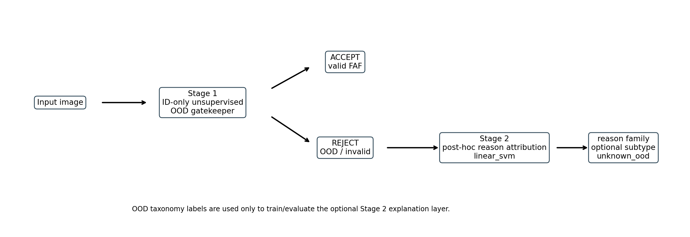
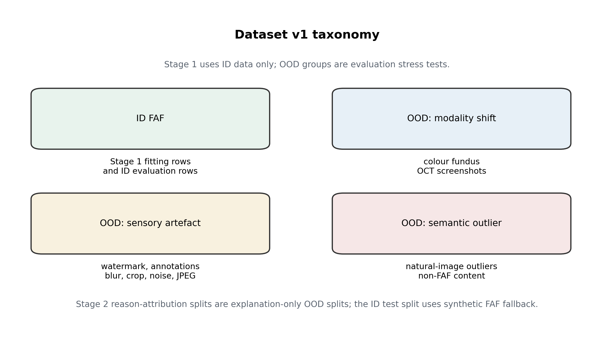
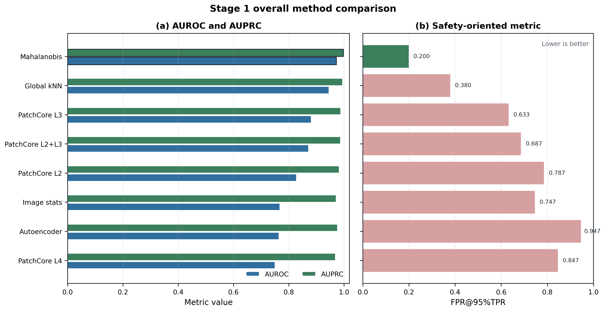
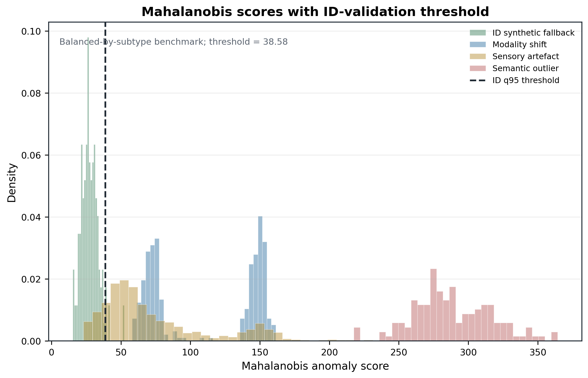
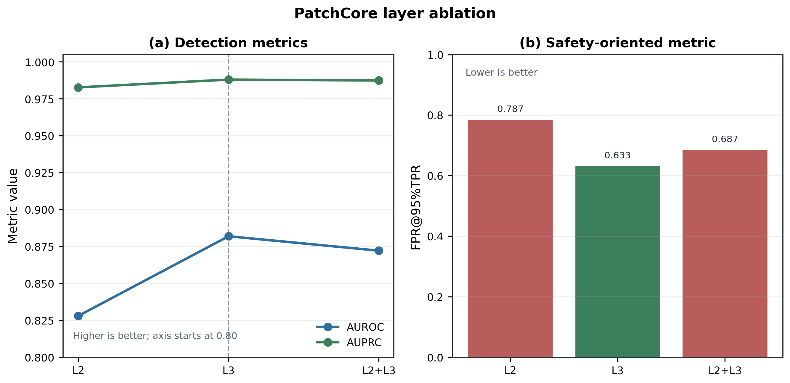
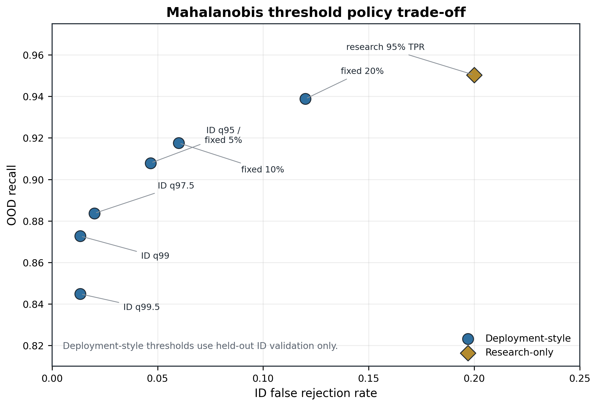
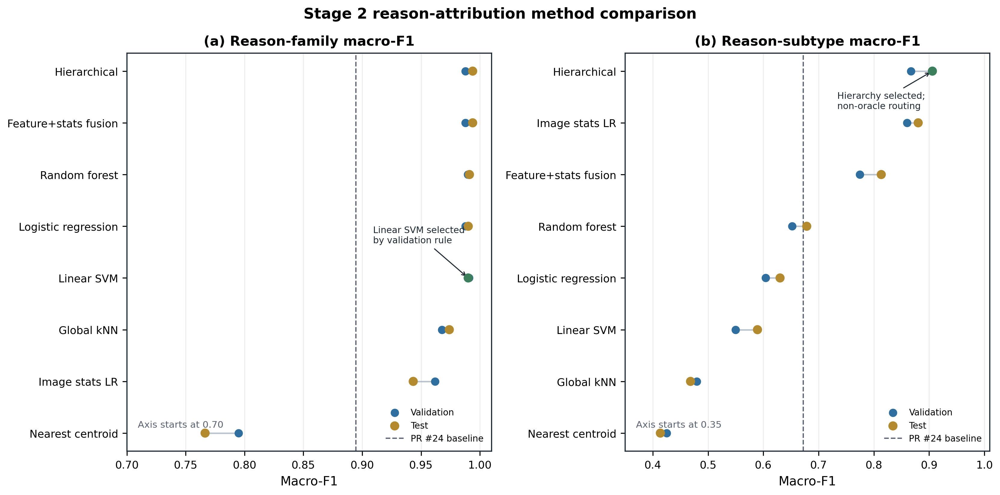
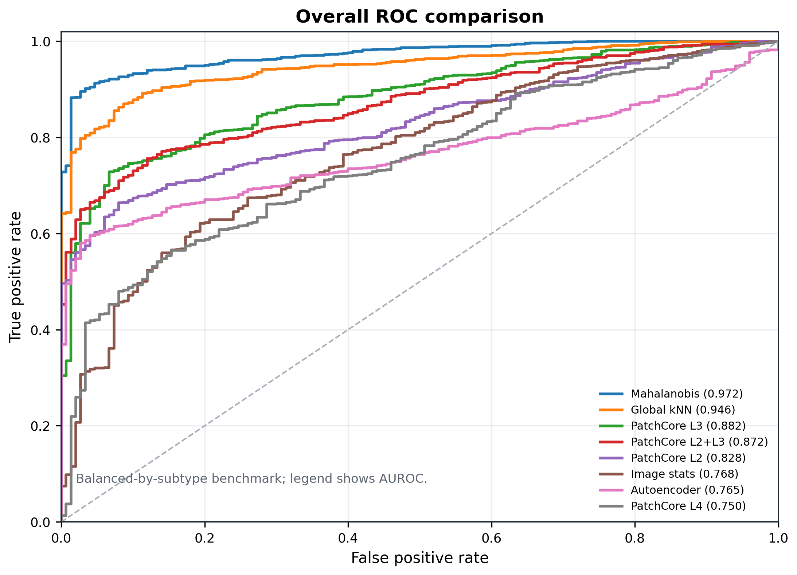
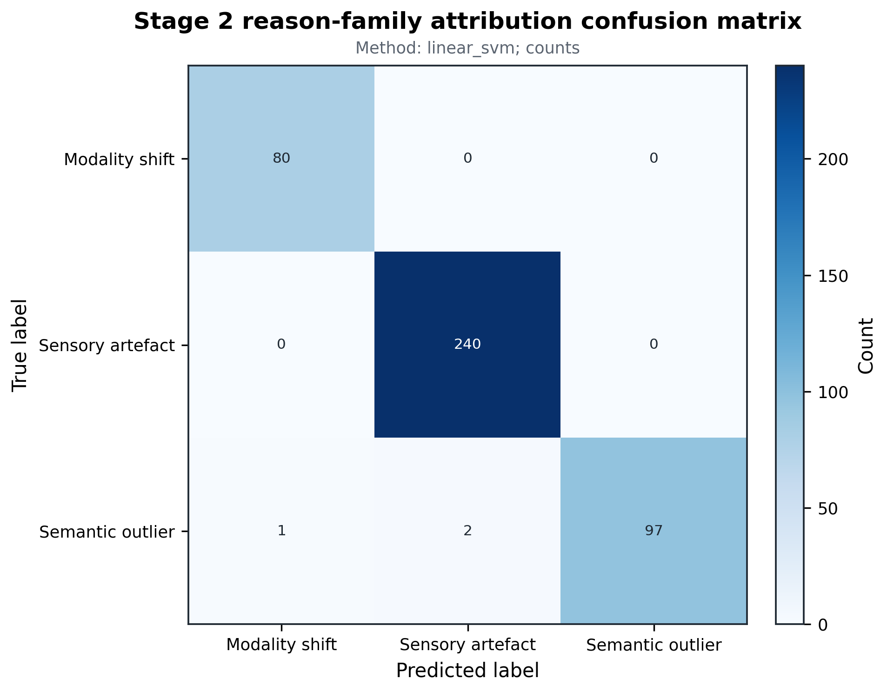
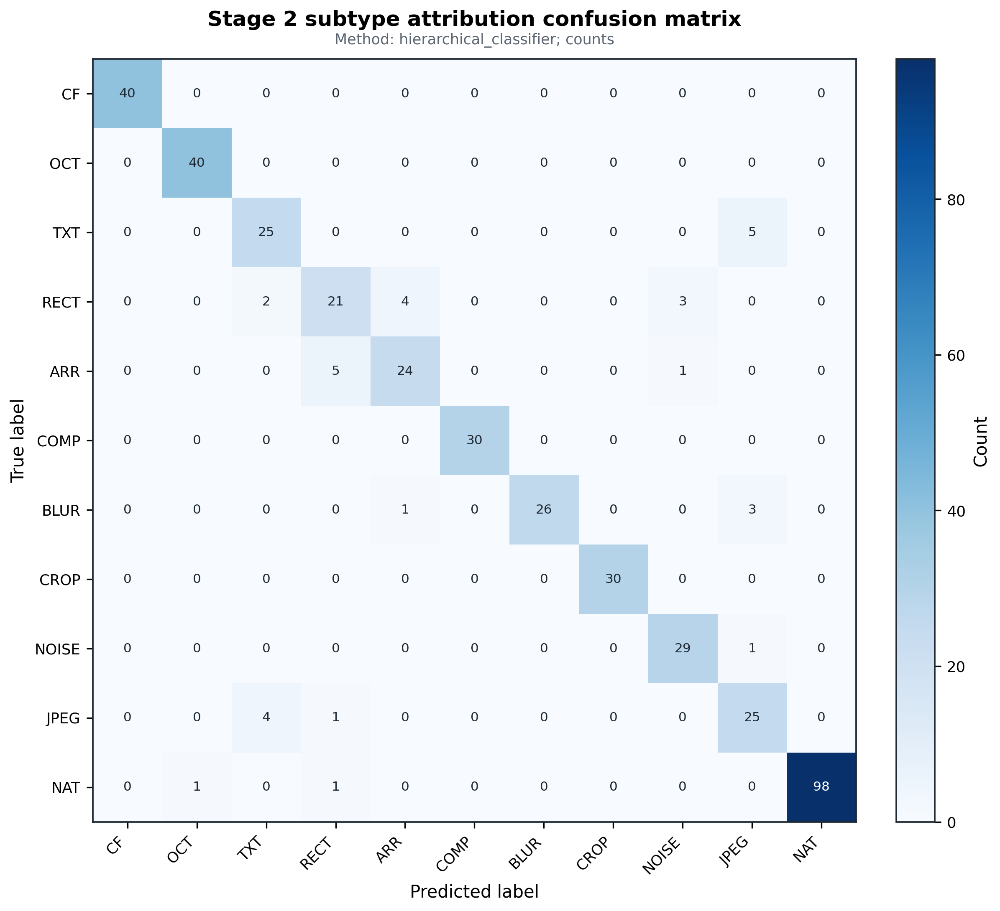

# Retinal FAF OOD Gatekeeper: Project Overview

This is the canonical supervisor-facing overview of the study. It consolidates the research
question, strategy, dataset, completed experiments, results, selected figures, conclusions,
limitations, and current status without requiring the reader to inspect source code.

## 1. Study in One Paragraph

Retinal image-analysis systems normally assume that every input is a valid fundus
autofluorescence (FAF) image, but a real workflow may receive a wrong imaging modality, an
annotated or degraded image, or unrelated content. This project develops an upstream
input-quality gatekeeper that makes a binary `ACCEPT` or `REJECT` decision before any downstream
diagnostic model is used. Stage 1 is an unsupervised out-of-distribution (OOD) detector fitted
using in-distribution (ID) FAF rows only. An optional Stage 2 module runs only after rejection
and assigns a likely reason family and, where appropriate, a subtype. On the current controlled
benchmark, Mahalanobis feature distance is the strongest quantitative Stage 1 method, while
PatchCore L3 provides the most useful localisation-oriented evidence. Stage 2 also performs
strongly on the current reason-attribution splits. However, the ID test set is synthetic FAF
fallback rather than real clinical FAF, so the complete system remains a research
proof-of-concept rather than evidence of clinical deployment readiness.

## 2. Core Research Question

**Primary research question**

**How can an ID-only unsupervised out-of-distribution detection system be designed and evaluated
as an upstream quality-control gatekeeper for retinal fundus autofluorescence imaging, so that
invalid or unexpected inputs can be rejected before they reach a downstream diagnostic model?**

Supporting questions are:

1. Which unsupervised OOD method provides the strongest quantitative gatekeeping performance?
2. How do the methods behave across modality shifts, sensory artifacts, and semantic outliers?
3. How do threshold choices affect OOD recall and valid-input false rejection?
4. Can patch-level methods provide useful localisation evidence for rejected inputs?
5. Can an optional post-rejection module provide a likely explanation for why an input was
   rejected?

Question 5 is an extension. It does not redefine the primary Stage 1 research problem or turn
the gatekeeper into a supervised OOD classifier.

## 3. Motivation and Research Gap

Conventional retinal classifiers are designed to predict a clinical target from an assumed-valid
input. They may not recognise that the input is the wrong modality, contains a watermark or
annotation, is heavily degraded, or is unrelated to retinal imaging. A model can therefore
produce a confident-looking disease prediction for an input that should never have reached the
diagnostic stage. This is a silent-failure risk.

The project separates input validation from diagnosis. The gatekeeper first asks whether an image
looks sufficiently like the valid FAF distribution. Only an accepted image would proceed to a
separate downstream analysis system. The project is not a disease classifier: it does not predict
disease classes, grades, biomarkers, or patient outcomes. Its purpose is input-quality control,
and the current evidence supports only a research proof-of-concept.

In this study, **ID** means the valid FAF distribution available during fitting, while **OOD**
means an input that falls outside that expected distribution. An anomaly score expresses how
unlike the ID reference an image appears. AUROC measures ranking across possible thresholds;
AUPRC summarises precision and recall but depends on class balance; and FPR@95%TPR measures the
valid-input false-positive rate when OOD sensitivity is fixed at 95%. These metrics answer
different questions, so no single value is treated as sufficient evidence of gatekeeper safety.

## 4. Strategy Used to Address the Research Question

The study followed this sequence:

1. Construct a manifest-driven dataset containing synthetic FAF ID images and structured OOD
   evaluation groups.
2. Fit every Stage 1 method using ID samples only.
3. Compare low-level statistics, reconstruction, global feature-distance, and patch-level OOD
   method families.
4. Evaluate ranking and safety-oriented behaviour using AUROC, AUPRC, FPR@95%TPR, OOD recall,
   and ID false rejection.
5. Analyse results by OOD family and subtype rather than relying only on aggregate metrics.
6. Examine threshold policies, bootstrap uncertainty, train-size sensitivity, artifact severity,
   disagreement, failure cases, feature-space structure, and runtime/resource behaviour.
7. Add an optional supervised Stage 2 reason-attribution module that runs after rejection.
8. Consolidate manifests, results, provenance, scripts, figures, and dissertation guidance into a
   reproducible repository bundle.

The architecture is deliberately separated:

```text
Stage 1:
input image -> ID-only unsupervised OOD gatekeeper -> ACCEPT / REJECT

Stage 2:
if REJECT -> optional supervised post-hoc reason attribution
```

OOD labels are not used to fit Stage 1. OOD taxonomy labels are used for held-out evaluation
grouping and as Stage 2 explanation targets. Stage 2 does not alter or override the Stage 1
accept/reject decision.

## 5. Dataset

Dataset v1 contains **3,100 curated images**: 1,000 synthetic FAF ID images and 2,100 OOD images.
Stage 1 uses 700 ID images for fitting, 150 ID images for validation and threshold calibration,
and 150 synthetic fallback ID images for testing. The OOD set covers three families and 11
subtypes:

- **Modality shift:** colour fundus and OCT screenshot.
- **Sensory artifact:** text watermark, rectangle annotation, arrow annotation, composite layout,
  blur artifact, border crop, Gaussian noise, and JPEG compression.
- **Semantic outlier:** CIFAR-10 natural images.

| Manifest | Rows | Role |
| --- | ---: | --- |
| [`train_id.csv`](../../datasets/dissertation_v1/manifests/train_id.csv) | 700 | Stage 1 ID-only fitting |
| [`val_id.csv`](../../datasets/dissertation_v1/manifests/val_id.csv) | 150 | ID validation and threshold calibration |
| [`test_id_synthetic_fallback.csv`](../../datasets/dissertation_v1/manifests/test_id_synthetic_fallback.csv) | 150 | Synthetic fallback ID test |
| [`test_ood_full.csv`](../../datasets/dissertation_v1/manifests/test_ood_full.csv) | 2,100 | Full OOD evaluation set |
| [`test_ood_balanced_by_subtype.csv`](../../datasets/dissertation_v1/manifests/test_ood_balanced_by_subtype.csv) | 1,650 | Main balanced OOD comparison set |
| [`reason_train.csv`](../../datasets/dissertation_v1/manifests/reason_train.csv) | 1,260 | OOD-only Stage 2 fitting |
| [`reason_val.csv`](../../datasets/dissertation_v1/manifests/reason_val.csv) | 420 | OOD-only Stage 2 validation |
| [`reason_test.csv`](../../datasets/dissertation_v1/manifests/reason_test.csv) | 420 | OOD-only Stage 2 test |

The ID test set is synthetic FAF fallback and is **not** real clinical FAF validation.
Reason-attribution manifests contain OOD rows only.

## 6. Stage 1 Methods

Eight completed configurations represent four broad strategies:

- **Image-statistics baseline:** uses low-level intensity, texture, edge, and border properties.
- **Autoencoder reconstruction:** learns to reconstruct ID FAF images and uses reconstruction error
  as the anomaly score.
- **Global feature kNN:** compares a test image with nearby ID examples in a pretrained feature
  space.
- **Mahalanobis feature distance:** measures statistical distance from the ID feature
  distribution.
- **PatchCore L2, L3, L4, and L2+L3:** compare local image patches with an ID memory bank and can
  produce spatial anomaly heatmaps.

These methods answer different parts of the study. Global feature-distance methods test whether
whole-image representations separate ID and OOD inputs. The autoencoder supplies a conventional
reconstruction baseline. PatchCore supplies local patch evidence and a layer-selection ablation.

## 7. Stage 1 Main Results

Mahalanobis feature distance is the selected quantitative Stage 1 method. It achieved AUROC
**0.9724**, AUPRC **0.9975**, and FPR@95%TPR **0.2000** on the balanced-by-subtype evaluation.
PatchCore L3 is the strongest evaluated PatchCore configuration and is retained as the
localisation-oriented companion. The autoencoder remains a useful reconstruction baseline but
has a much weaker FPR@95%TPR of **0.9467**.

| Method | AUROC | AUPRC | FPR@95%TPR | Main role |
| --- | ---: | ---: | ---: | --- |
| Mahalanobis feature | 0.9724 | 0.9975 | 0.2000 | Strongest quantitative gatekeeper |
| Global feature kNN | 0.9458 | 0.9949 | 0.3800 | Strong feature-distance baseline |
| PatchCore L3 | 0.8819 | 0.9880 | 0.6333 | Best PatchCore/localisation configuration |
| PatchCore L2+L3 | 0.8722 | 0.9874 | 0.6867 | Patch-level comparison |
| PatchCore L2 | 0.8280 | 0.9828 | 0.7867 | Patch-level comparison |
| Image statistics | 0.7681 | 0.9717 | 0.7467 | Low-level baseline |
| Autoencoder | 0.7649 | 0.9763 | 0.9467 | Reconstruction baseline |
| PatchCore L4 | 0.7502 | 0.9692 | 0.8467 | Patch-level comparison |

AUPRC is influenced by the OOD-heavy evaluation balance (1,650 OOD versus 150 ID rows in the main
set). It should therefore be interpreted alongside AUROC and the safety-oriented FPR@95%TPR.

### Key Result Index

| Research question addressed | Method or experiment | Verified result | Conclusion | Evidence |
| --- | --- | --- | --- | --- |
| Which method is strongest quantitatively? | Eight-scheme Stage 1 comparison | Mahalanobis: AUROC 0.9724, AUPRC 0.9975, FPR@95%TPR 0.2000 | Mahalanobis is the primary quantitative Stage 1 method on this benchmark. | [`metrics_by_scheme.csv`](../../reports/dissertation_results/multi_scheme_comparison/metrics_by_scheme.csv) |
| How do thresholds affect safety? | ID-calibrated threshold sweep | Mahalanobis ID q95: ID false rejection 0.0467, OOD recall 0.9079 | Threshold choice creates a measurable sensitivity/specificity trade-off. | [`threshold_policy_sweep.csv`](../../reports/dissertation_results/robustness_analysis/threshold_policy_sweep.csv) |
| Can patch methods add useful evidence? | PatchCore ablation and disagreement analysis | PatchCore L3 is the best PatchCore and catches 111 Mahalanobis false negatives | PatchCore is weaker overall but useful for localisation and complementary examples. | [`layer_ablation_table.csv`](../../reports/dissertation_results/primary_balanced_by_subtype_10k/layer_ablation_table.csv), [`method_disagreement_cases.md`](../../reports/dissertation_results/robustness_analysis/method_disagreement_cases.md) |
| Can rejected inputs be explained? | Stage 2 method comparison | Linear SVM family macro-F1 0.9901; hierarchical subtype macro-F1 0.9059 | Optional post-rejection explanations are feasible on the current controlled splits. | [`best_method_summary.md`](../../reports/dissertation_results/reason_attribution_method_comparison/best_method_summary.md) |

## 8. Additional Stage 1 Analysis

| Analysis | What was tested | Main conclusion | Evidence |
| --- | --- | --- | --- |
| PatchCore layer ablation | L2, L3, and L2+L3 patch features | L3 is the strongest PatchCore configuration and the preferred localisation model. | [`layer_ablation_table.md`](../../reports/dissertation_results/primary_balanced_by_subtype_10k/layer_ablation_table.md) |
| Per-type analysis | Performance across the three OOD families | Broad global shifts are generally easier than subtle local artifacts. | [`per_ood_type_by_scheme.md`](../../reports/dissertation_results/multi_scheme_comparison/per_ood_type_by_scheme.md) |
| Per-subtype analysis | Performance across 11 OOD subtypes | Text watermark is the main Stage 1 weakness for Mahalanobis. | [`per_ood_subtype_by_scheme.md`](../../reports/dissertation_results/multi_scheme_comparison/per_ood_subtype_by_scheme.md) |
| Threshold policy | Research and ID-calibrated thresholds | Validation-ID calibration is appropriate for a prototype; research thresholds are evaluation-only. | [`threshold_policy_sweep.md`](../../reports/dissertation_results/robustness_analysis/threshold_policy_sweep.md) |
| Bootstrap analysis | Uncertainty in AUROC, AUPRC, and FPR@95%TPR | Mahalanobis ranking is stable for AUROC/AUPRC; FPR intervals are wider and overlap. | [`bootstrap_ci.md`](../../reports/dissertation_results/robustness_analysis/bootstrap_ci.md) |
| Train-size sensitivity | ID fitting subsets from 50 to 700 images | Mahalanobis is strong with limited ID data and ranking performance begins to saturate around 500-700 images. | [`train_size_sensitivity.md`](../../reports/dissertation_results/robustness_analysis/train_size_sensitivity.md) |
| Artifact-severity stress test | Increasing severity for generated artifacts | Detection is mixed; watermark and JPEG remain difficult, so monotonic improvement cannot be assumed. | [`artifact_severity_stress.md`](../../reports/dissertation_results/robustness_analysis/artifact_severity_stress.md) |
| Method disagreement | Agreement and complementary errors across methods | Mahalanobis is stronger overall, while PatchCore catches many local watermark misses. | [`method_disagreement_cases.md`](../../reports/dissertation_results/robustness_analysis/method_disagreement_cases.md) |
| Failure-case analysis | False positives, false negatives, and subtype influence | Mahalanobis false negatives are dominated by text watermark examples. | [`subtype_influence.md`](../../reports/dissertation_results/robustness_analysis/subtype_influence.md) |
| Feature-space PCA | Two-dimensional projection of evaluation features | Semantic outliers and several modality shifts separate clearly; watermark remains close to ID. | [`feature_space_projection.csv`](../../reports/dissertation_results/robustness_analysis/feature_space_projection.csv) |
| Runtime/resource comparison | Local smoke scoring time and artifact size | Mahalanobis gives the best current performance/resource trade-off; PatchCore costs more but adds heatmaps. | [`runtime_resource_summary.md`](../../reports/dissertation_results/robustness_analysis/runtime_resource_summary.md) |

## 9. Optional Stage 2 Reason Attribution

Stage 2 is a supervised post-hoc explanation module. It is evaluated separately and runs only
after Stage 1 has already returned `REJECT`. It does not participate in the unsupervised
accept/reject decision.

The selected reason-family method is **linear SVM**, with test accuracy **0.9881** and test
macro-F1 **0.9901**. The hardest family is `semantic_outlier`. The selected subtype method is the
non-oracle **hierarchical classifier**, with test accuracy **0.9238** and test macro-F1
**0.9059**. Its test-time routing uses the predicted family rather than the ground-truth family.
The hardest subtype is `rectangle_annotation`.

Reason labels describe likely causes of rejection, not clinical diagnoses. The reason splits are
disjoint by image path, but generated sensory-artifact variants have `parent_image_hash` overlap
across train, validation, and test. This may make Stage 2 results optimistic for
parent-independent generalisation and remains a documented limitation in the
[`leakage sanity check`](../../reports/dissertation_results/reason_attribution_method_comparison/leakage_sanity_check.md).

## 10. Selected Figures

### 1. Two-stage rejected-input explanation pipeline



**Purpose:** Defines the upstream Stage 1 rejection decision and the optional post-rejection
Stage 2 explanation layer.
**Conclusion:** Stage 1 remains ID-only and unsupervised; Stage 2 explains likely rejection
reasons after rejection and does not diagnose disease.
**Evidence:** [`final figure index`](../../reports/dissertation_final/final_figure_index.md).

### 2. Dataset taxonomy



**Purpose:** Shows the ID/OOD structure and three OOD families.
**Conclusion:** The benchmark is a controlled taxonomy of modality, artefact, and semantic
stress tests.
**Evidence:** [`dataset v1 documentation`](../datasets/dissertation_dataset_v1.md).

### 3. Stage 1 overall method comparison



**Purpose:** Combines AUROC/AUPRC with the safety-oriented FPR@95%TPR comparison.
**Conclusion:** Mahalanobis feature distance gives the strongest aggregate quantitative result
and the lowest FPR@95%TPR estimate in the final Stage 1 comparison.
**Evidence:** [`metrics by scheme`](../../reports/dissertation_results/multi_scheme_comparison/metrics_by_scheme.md).

### 4. Stage 1 score distribution and threshold



**Purpose:** Shows the Mahalanobis score separation and the held-out ID-validation threshold.
**Conclusion:** Global shifts separate clearly, while sensory artefacts overlap more with ID
scores and motivate cautious threshold interpretation.
**Evidence:** [`threshold policy sweep`](../../reports/dissertation_results/robustness_analysis/threshold_policy_sweep.md).

### 5. PatchCore layer ablation



**Purpose:** Tests which PatchCore feature layer is most useful.
**Conclusion:** L3 is the strongest evaluated PatchCore configuration and the selected
localisation-oriented model.
**Evidence:** [`PatchCore layer ablation`](../../reports/dissertation_results/primary_balanced_by_subtype_10k/layer_ablation_table.md).

### 6. Mahalanobis threshold-policy trade-off



**Purpose:** Visualises OOD recall against valid-input false rejection for alternative policies.
**Conclusion:** Greater OOD recall requires accepting more ID false rejection; q95 is the balanced
ID-calibrated prototype policy.
**Evidence:** [`threshold policy sweep`](../../reports/dissertation_results/robustness_analysis/threshold_policy_sweep.md).

### 7. Stage 2 reason-attribution method comparison



**Purpose:** Compares reason-family and reason-subtype attribution methods after rejection.
**Conclusion:** Linear SVM is selected for family attribution, and the non-oracle hierarchical
classifier is selected for subtype attribution.
**Evidence:** [`Stage 2 experiment description`](../experiments/reason_attribution_method_comparison.md).

### 8. Full Stage 1 ROC comparison



**Purpose:** Provides appendix-level curve evidence for all eight Stage 1 configurations.
**Conclusion:** The ROC curves confirm the overall ranking without replacing the combined main
comparison figure.
**Evidence:** [`metrics by scheme`](../../reports/dissertation_results/multi_scheme_comparison/metrics_by_scheme.md).

### 9. Best family confusion matrix



**Purpose:** Shows where the selected family method makes errors.
**Conclusion:** Family errors are rare and concentrate in semantic outliers.
**Evidence:** [`best method summary`](../../reports/dissertation_results/reason_attribution_method_comparison/best_method_summary.md).

### 10. Best subtype confusion matrix



**Purpose:** Shows fine-grained error structure for the non-oracle hierarchical classifier.
**Conclusion:** Subtype attribution is strong overall, while rectangle annotation remains the
hardest subtype.
**Evidence:** [`subtype label mapping`](../../reports/dissertation_final/subtype_label_mapping.md)
and [`leakage sanity check`](../../reports/dissertation_results/reason_attribution_method_comparison/leakage_sanity_check.md).

## 11. Main Conclusions

1. An ID-only FAF OOD gatekeeper is feasible as a reproducible proof-of-concept.
2. Mahalanobis feature distance is the strongest quantitative Stage 1 method on the current
   benchmark.
3. PatchCore L3 provides the most useful localisation-oriented evidence.
4. Threshold choice creates a measurable trade-off between OOD recall and valid-input false
   rejection.
5. The optional Stage 2 module can provide useful family- and subtype-level explanations after
   rejection.
6. The results do not establish clinical deployment readiness.

## 12. Limitations

- The ID test set is synthetic FAF fallback rather than real clinical FAF validation.
- No result supports a claim of clinical deployment readiness.
- The OOD benchmark is a controlled stress test, not an estimate of clinical prevalence.
- Stage 2 is supervised and limited to known reason families and subtypes.
- `parent_image_hash` overlap exists across Stage 2 splits for generated artifact variants.
- Stage 2 predictions are likely explanations, not clinical diagnoses.
- Future scanner, site, protocol, and population variation is not comprehensively represented.

## 13. Current Status and Next Steps

Dataset construction and audit are complete. The Stage 1 multi-method comparison, PatchCore
ablation, threshold analysis, robustness and failure analysis, Stage 2 implementation and
comparison, reproducibility bundle, and final figure/reporting polish are complete. The current
priority is dissertation writing: integrating the evidence into coherent chapters, captions,
tables, and discussion. Real clinical FAF validation, prospective threshold calibration, broader
scanner/site testing, and parent-grouped Stage 2 splits remain future research rather than
unfinished claims in the present study.

## 14. Where to Find the Evidence

| Area | Canonical location |
| --- | --- |
| Final result summary | [`reports/dissertation_final/final_result_summary.md`](../../reports/dissertation_final/final_result_summary.md) |
| Final evidence index | [`docs/dissertation/final_evidence_index.md`](final_evidence_index.md) |
| Stage 1 comparison | [`reports/dissertation_results/multi_scheme_comparison/`](../../reports/dissertation_results/multi_scheme_comparison/) |
| Robustness and failure analysis | [`reports/dissertation_results/robustness_analysis/`](../../reports/dissertation_results/robustness_analysis/) |
| Stage 2 comparison | [`reports/dissertation_results/reason_attribution_method_comparison/`](../../reports/dissertation_results/reason_attribution_method_comparison/) |
| Figure index | [`reports/dissertation_final/final_figure_index.md`](../../reports/dissertation_final/final_figure_index.md) |
| Dataset manifests | [`datasets/dissertation_v1/manifests/`](../../datasets/dissertation_v1/manifests/) |
| Reproducibility instructions | [`docs/dissertation/reproducibility_runbook.md`](reproducibility_runbook.md) |
| Manuscript draft material | [`docs/dissertation/manuscript_draft/`](manuscript_draft/) |
| Progressive milestone log | [`docs/dissertation/progress_log.md`](progress_log.md) |
